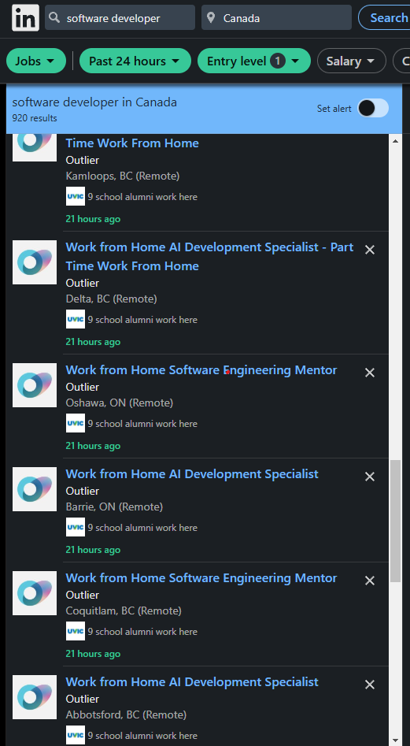

# LinkedInBlock

A Chrome extension that helps you declutter your LinkedIn job search by allowing you to block specific companies from appearing in your job posting lists.

_Example: Multiple identical job postings from recruiting agencies cluttering search results_

&nbsp;

## Features

-   Block companies that you're not interested in seeing job postings from
-   Automatically hide job postings from blocked companies
-   Manage your list of blocked companies
-   Clean and simple interface
-   Works on LinkedIn job search pages

## Why Use LinkedInBlock?

If you're tired of seeing repetitive job postings from companies you're not interested in, this extension is for you. It helps you:

-   Save time by filtering out irrelevant job postings
-   Focus on companies you actually want to work for
-   Avoid spam from aggressive recruiting agencies (as shown in the example above)
-   Customize your job search experience

## Installation

1. Download or clone this repository
2. Open Chrome and go to `chrome://extensions/`
3. Enable "Developer mode" in the top right
4. Click "Load unpacked" and select the extension directory

## Usage

1. Navigate to LinkedIn's job search page
2. Click the LinkedInBlock extension icon
3. Use the interface to block/unblock companies
4. Blocked companies' job postings will automatically be hidden from your search results

## License

MIT License - feel free to use this code in your own projects.
